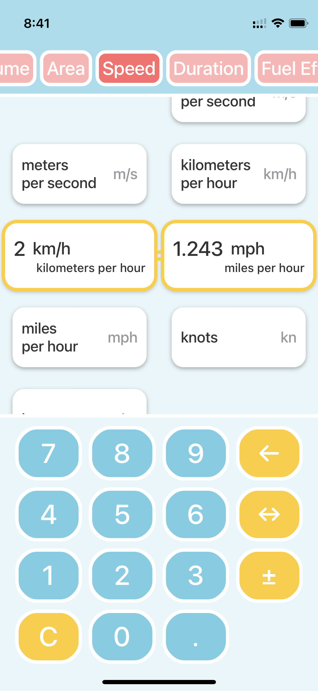

# EasyUnit Converter

The unit-converting application is designed to make converting between different units a breeze. With a user-friendly interface that combines unit selection and value input on a single screen.

Technologies: SwiftUI

&nbsp;&nbsp;&nbsp;&nbsp;&nbsp;&nbsp;&nbsp;&nbsp;
